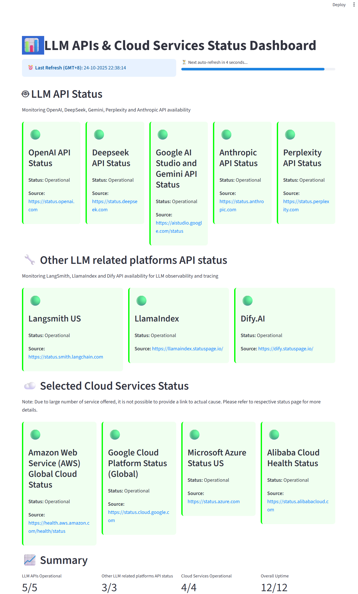

# LLM & Cloud API Status Dashboard

A real-time Streamlit dashboard for monitoring LLM API and cloud service statuses with automatic 60-second refresh.

## 🚀 Live Demo on Streamlit

Due to large memory consumption, i have remove the application that was hosted on streamlit. 

Note: *packages.txt* contains necessary apt package for streamlit server to install the deprecated python packages in order for the app to work.

## Sample page



## Features

- **LLM API Monitoring**: OpenAI, DeepSeek, Gemini, Anthropic, Perplexity, LangSmith, LlamaIndex, and Dify
- **Cloud Services Monitoring**: AWS, Google Cloud Platform, Microsoft Azure, and Alibaba Cloud
- **Auto-refresh**: Every 60 seconds with automatic page reload
- **Visual Status Indicators**: Color-coded status cards with source links
- **Chrome Integration**: Separate Chrome driver instances for dynamic content scraping
- **5 minutes polling of status** for status update
- **Resource Optimized**: Efficient connection pooling and cloud-ready deployment

## Status Indicators

- 🟢 **Green**: Service is operational
- 🔴 **Red**: Issues detected  
- 🟡 **Yellow**: Status unknown or error fetching data

## Installation

### Using uv

Recommended Python version for compatibility: **3.12**

```bash
uv python install 3.12
uv python pin 3.12
```

1. Install uv:
```bash
curl -LsSf https://astral.sh/uv/install.sh | sh
```

2. Setup and run:
```bash
uv sync
uv run streamlit run app_main.py
```
Do not run `uv run app_main.py` directly; always launch through Streamlit.

Windows (recommended for enterprise/network TLS interception):
```powershell
uv sync --native-tls
uv run --native-tls streamlit run app_main.py
```

## Browser Requirements

Chrome browser is required for Gemini, Alibaba Cloud, and Dify status monitoring. The dashboard uses separate Chrome driver instances to prevent interference.

## Usage

The dashboard automatically:
- Fetches status information from various API endpoints
- Displays real-time status with color-coded indicators
- Auto-refreshes every 60 seconds
- Runs all status checks concurrently for faster loading

## Operational Status Logic

### LLM API Services

**OpenAI API**: Checks RSS feed for "all impacted services have now fully recovered"
**DeepSeek API**: Checks Atom feed for "resolved" status
**Google Gemini API**: Uses Chrome driver to check dynamic status page
**Anthropic API**: Checks RSS feed for "resolved" status
**Perplexity API**: Checks RSS feed for "resolved" and no "api outage"
**LangSmith API**: Checks RSS feed for "resolved" status
**LlamaIndex API**: Checks HTML for "no incidents reported today"
**Dify API**: Uses Chrome driver to check dynamic status page

### Cloud Services

**AWS**: Operational if no RSS feed entries, Disrupted if entries exist
**Google Cloud Platform**: Checks Atom feed for "resolved:" in title
**Microsoft Azure**: Operational if no RSS feed entries, Disrupted if entries exist
**Alibaba Cloud**: Uses Chrome driver to check dynamic status page

## Technical Architecture

- **Async Loading**: All status checks run concurrently using asyncio
- **Chrome Management**: Separate driver instances for different services
- **Resource Optimization**: 75% reduction in connection pool usage
- **Error Handling**: Individual service failures don't affect others
- **Cloud Ready**: Optimized for Streamlit Community Cloud deployment

## Recent Optimizations

- **Connection Pool**: Reduced from 20 to 5 maximum connections
- **Lightweight Sessions**: Individual sessions for single requests
- **Memory Management**: Aggressive cleanup and garbage collection
- **Fallback Mechanisms**: HTTP fallback when Chrome drivers fail
- **Cloud Deployment**: Successfully deployed to Streamlit Community Cloud

## Troubleshooting

### Common Issues
- **"Connection pool is full"**: Automatically handled by lightweight sessions
- **Chrome driver failures**: HTTP fallback mechanisms in place
- **Memory issues**: Automatic cleanup and garbage collection

## Development

```bash
make help          # Show all available commands
make setup         # Setup uv environment
make run           # Run the dashboard
make test          # Run tests
make lint          # Run linting
```

## Dependencies

- `streamlit>=1.28.0`: Web dashboard framework
- `requests>=2.31.0`: HTTP requests
- `beautifulsoup4>=4.12.0`: HTML parsing
- `feedparser>=6.0.10`: RSS/Atom feed parsing
- `selenium>=4.15.0`: WebDriver automation
- `undetected-chromedriver>=3.5.0`: Chrome driver management

## Notes

- Status determination is based on keyword/phrase matching
- Some services may show "Unknown" if status pages are inaccessible
- Chrome browser is required for Gemini, Alibaba Cloud, and Dify
- All status checks run concurrently for optimal performance

## Disclaimer

The operational status is based on keyword/phrase matching and pattern analysis by my own assumption. Any changes in link or assumed keywords/phrasing may lead to inaccurate status provided. This is a prototype project developed with AI assistance and is not meant to be optimal or secure. Feel free to expand or adopt parts of the logic for your use case.