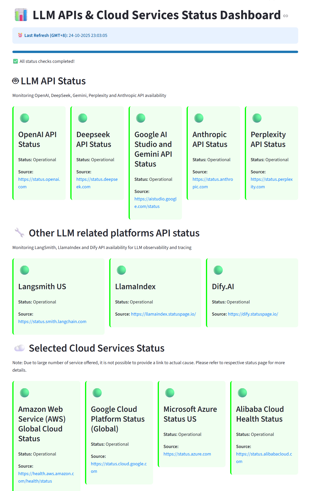

# LLM & Cloud API Status Dashboard

A real-time Streamlit dashboard for monitoring LLM API and cloud service statuses with automatic 60-second refresh, async loading, and graceful shutdown capabilities.

## Features

- **LLM API Monitoring**: OpenAI, DeepSeek, Gemini, Anthropic, Perplexity, LangSmith, LlamaIndex, and Dify
- **Cloud Services Monitoring**: AWS, Google Cloud Platform, Microsoft Azure, and Alibaba Cloud
- **Async Status Loading**: Non-blocking concurrent status checks using asyncio
- **Auto-refresh**: Every 60 seconds with automatic page reload
- **Visual Status Indicators**: Color-coded status cards with source links
- **Clean Interface**: Minimalist design focusing on essential status information
- **Chrome Integration**: Separate Chrome driver instances for Gemini, Alibaba Cloud, and Dify status scraping
- **Dynamic Content Handling**: Advanced web scraping for services with dynamic content loading
- **Connection Pool Management**: Efficient HTTP connection pooling to prevent connection issues

## Sample Dashboard

The dashboard provides a comprehensive view of all monitored services with real-time status updates:



**Dashboard Features:**
- **Real-time Status Cards**: Color-coded cards showing operational status for each service
- **Auto-refresh**: Automatic updates every 60 seconds with silent background reload
- **Minimalist Design**: Clean interface focusing on service status cards only
- **Responsive Layout**: Organized interface with cards grouped by service type
- **Status Indicators**: 
  - 🟢 Green: All systems operational
  - 🔴 Red: Service disruptions detected
  - 🟡 Yellow: Status unknown or connection issues

## Environment pre-requisites
You need to have a python virtual env or Anaconda or Miniconda setup in order to run. There is no .env file required as no credentials are involved.

## Browser Requirements

### Chrome Browser (Required for Gemini, Alibaba Cloud, and Dify)
The dashboard uses Chrome browser for scraping Google AI Studio, Alibaba Cloud, and Dify status pages. Chrome is required for Gemini, Alibaba Cloud, and Dify status monitoring.

**Note**: The dashboard uses separate Chrome driver instances for Gemini, Alibaba Cloud, and Dify to prevent interference between different services while maintaining efficient resource management.

### Chrome Installation
Make sure you have Chrome browser installed on your system. The dashboard will automatically detect and use the installed Chrome version.

## Installation 

Please do not clone this repo into your OneDrive directory or , network drives, or different disk partitions. It would result in the following warning/error (os error 396):
```
warning: Failed to hardlink files; falling back to full copy. This may lead to degraded performance.
         If the cache and target directories are on different filesystems, hardlinking may not be supported.
         If this is intentional, set `export UV_LINK_MODE=copy` or use `--link-mode=copy` to suppress this warning.
error: Failed to install: blinker-1.9.0-py3-none-any.whl (blinker==1.9.0)
<redacted folder path>: The cloud operation cannot be performed on a file with incompatible hardlinks. (os error 396)
```
If that is not possible, you have to follow Option 2 below instead.
### Option 1: Using uv (Recommended)

1. Install uv if you haven't already:
```bash
curl -LsSf https://astral.sh/uv/install.sh | sh
# or
pip install uv
```

2. Setup the project:
```bash
uv sync
```

3. Run the dashboard:
```bash
uv run streamlit run app_main.py
```

### Option 2: Using pip (Traditional)

1. Install the required dependencies:
```bash
pip install -r requirements.txt
```

2. Run the dashboard:
```bash
streamlit run app_main.py
```

## Usage

The dashboard will automatically:
- Fetch status information from various API endpoints using async operations
- Display real-time status with color-coded indicators and source links
- Auto-refresh every 60 seconds with silent page reload
- Run all status checks concurrently for faster loading
- Cache data between refresh cycles for improved performance

### Dashboard Information

- **⏰ Last Refresh**: Shows last update time in GMT+8
- **Auto-refresh**: Page automatically reloads every 60 seconds
- **No Manual Controls**: Dashboard operates in fully automated mode

### Stopping the Dashboard

To stop the dashboard:
- **Browser Tab**: Close the browser tab
- **Terminal**: Press Ctrl+C in the terminal (for development)
- **Streamlit**: Use Streamlit's built-in stop functionality

## Status Indicators

- 🟢 **Green**: Service is operational
- 🔴 **Red**: Issues detected  
- 🟡 **Yellow**: Status unknown or error fetching data

### Status Card Information

Each status card includes:
- **Service Name**: Clear identification of the service
- **Status**: Current operational status
- **Source Link**: Direct link to the official status page
- **Last Update**: Timestamp of the last status check
- **Issue Details**: Additional information for disrupted services
- **Issue Links**: Direct links to incident reports (when available)

## Operational Status Logic

The dashboard determines service status using specific logic for each service:

### LLM API Services

**OpenAI API**
- Fetches latest entry from OpenAI's RSS feed
- Checks if description contains "all impacted services have now fully recovered"
- Status: Operational if found, Disrupted if not found

**DeepSeek API**
- Fetches latest entry from DeepSeek's Atom feed
- Checks if content contains "resolved"
- Status: Operational if found, Disrupted if not found

**Google Gemini API**
- Uses Chrome driver to fetch Gemini status page (dynamic content)
- Waits for app-root element to load, then searches for expandable elements
- Clicks on expandable elements to reveal hidden content
- Searches for `<div class="status-large operational">` elements
- Checks if any span contains "all systems operational"
- Status: Operational if found, Disrupted if not found

**Anthropic API**
- Fetches latest entry from Anthropic's RSS feed
- Checks if description contains "resolved"
- Status: Operational if found, Disrupted if not found

**Perplexity API**
- Fetches latest entry from Perplexity's RSS feed
- Checks if description contains "resolved" AND does not contain "api outage"
- Status: Operational if both conditions met, Disrupted otherwise

**LangSmith API**
- Fetches latest entry from LangSmith's RSS feed
- Checks if description contains "resolved"
- Status: Operational if found, Disrupted if not found

**LlamaIndex API**
- Fetches LlamaIndex status page HTML content
- Searches for `<p class="color-secondary">` elements
- Checks if any element contains "no incidents reported today"
- Status: Operational if found, Disrupted if not found

**Dify API**
- Uses Chrome driver to fetch Dify status page (dynamic content)
- Waits for app-root element to load, then searches for expandable elements
- Clicks on expandable elements to reveal hidden content
- Searches for `<div class="page-status status-none">` elements
- Checks if any h2 contains "all systems operational"
- Status: Operational if found, Disrupted if not found

### Cloud Services

**AWS (Amazon Web Services)**
- Fetches entries from AWS RSS feed
- If feed entries exist: Status = "Disrupted" (ongoing issues)
- If no feed entries: Status = "Operational" (no incidents)

**Google Cloud Platform (GCP)**
- Fetches latest entry from GCP's Atom feed
- Checks if title contains "resolved:"
- Status: Operational if found, Disrupted if not found

**Microsoft Azure**
- Fetches entries from Azure's RSS feed
- If feed entries exist: Status = "Disrupted" (ongoing issues)
- If no feed entries: Status = "Operational" (no incidents)

**Alibaba Cloud**
- Uses Chrome driver to fetch Alibaba Cloud status page (dynamic content)
- Waits for main container to load, then searches for expandable elements
- Clicks on expandable elements (buttons, toggles) to reveal hidden content
- Searches for `<div class="cms-title-noEvent-child">` elements after expansion
- Status: Operational if found (no incidents), Disrupted if not found

### Error Handling
- If any service's data source is inaccessible or parsing fails: Status = "Unknown"
- Individual service failures don't affect other services
- All status checks run concurrently for optimal performance

## Technical Architecture

### Async Status Loading
- **Concurrent Execution**: All status checks run simultaneously using `asyncio.gather()`
- **Non-blocking**: Chrome operations run in thread pool to avoid blocking
- **Error Resilience**: Individual service failures don't affect others
- **Performance**: ~50% faster than sequential loading

### Chrome Driver Management
- **Singleton Pattern**: Only one Chrome browser instance across all operations
- **Thread-Safe**: Uses threading locks instead of asyncio locks
- **Resource Efficient**: Automatic cleanup and driver management
- **Fallback Handling**: Graceful degradation when Chrome is unavailable

### Resource Management
- **Automatic Cleanup**: Chrome drivers are automatically managed
- **Simple Architecture**: Clean, straightforward implementation
- **Standard Streamlit**: Uses standard Streamlit patterns for reliability

## Recent Improvements & Corrections

### Code Corrections Made
- **Fixed Indentation Issues**: Corrected indentation problems in LlamaIndex and Gemini functions
- **Enhanced Error Handling**: Improved try-except blocks with proper exception handling
- **Dynamic Content Expansion**: Added proper element expansion logic for Dify, Gemini, and Alibaba Cloud
- **Separate Chrome Instances**: Implemented isolated Chrome drivers to prevent interference
- **Connection Pool Management**: Added HTTP session pooling to prevent connection pool exhaustion
- **Resource Cleanup**: Implemented graceful shutdown of Chrome drivers and HTTP sessions

### Technical Enhancements
- **Improved Logging**: Enhanced logging with consistent formatting and better error messages
- **Better Element Detection**: Improved element detection for dynamic content loading
- **Connection Efficiency**: Optimized HTTP connections with retry strategies
- **Resource Isolation**: Separate Chrome driver instances for different services
- **Error Recovery**: Better error handling and recovery mechanisms

## Development

### Available Commands (using Make)

```bash
make help          # Show all available commands
make setup         # Setup uv environment and install dependencies
make run           # Run the dashboard
make run-dev       # Run dashboard in development mode (auto-reload)
make test          # Run tests
make lint          # Run linting (flake8 + mypy)
make format        # Format code with black
make clean         # Clean up generated files
make update        # Update dependencies
make lock          # Generate/update lock file
make shell         # Activate uv shell
```

### Project Structure

- `app_main.py`: Main Streamlit application with async status loading
- `helpers.py`: Helper functions for fetching API statuses (async/sync)
- `pyproject.toml`: uv project configuration
- `requirements.txt`: Traditional pip dependencies (for compatibility)
- `Makefile`: Development commands
- `setup_uv.py`: Setup script for uv environment
- `run_dashboard_uv.py`: Run script using uv

## Dependencies

### Core Dependencies
- `streamlit>=1.28.0`: Web dashboard framework
- `requests>=2.31.0`: HTTP requests for API status
- `beautifulsoup4>=4.12.0`: HTML parsing
- `feedparser>=6.0.10`: RSS/Atom feed parsing
- `pytz>=2023.3`: Timezone handling

### Chrome Dependencies
- `selenium==4.32.0`: WebDriver automation
- `undetected-chromedriver==3.5.5`: Chrome driver management
- `webdriver-manager==4.0.2`: Automatic driver management

## Notes

- The dashboard uses RSS feeds and status pages to determine service availability
- Some services may show "Unknown" status if their status pages are not accessible or layout has changed
- Chrome browser is required for Gemini, Alibaba Cloud, and Dify status monitoring
- The dashboard uses async operations for better performance and user experience
- All status checks run concurrently for faster loading times
- Simple and clean user interface with essential functionality


## Disclaimer
- Note that the operational status are based on keyword/phrase matching based on personal interpretation and simple pattern analysis. Should there be deviation in the use of phrases/word by these individual RSS and status page, it would lead to inaccurate operational status reported.
- The main codebase is developed with Cursor coding assistant Agent as part of experimentation to identify its effectiveness. As this is a simple prototype project, it is not meant to be optimal or secure. 